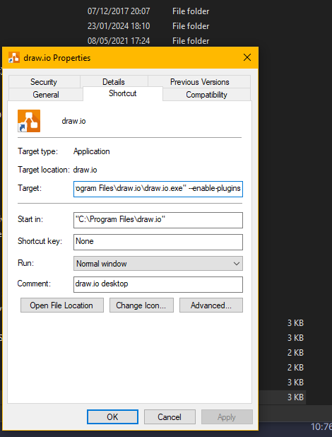
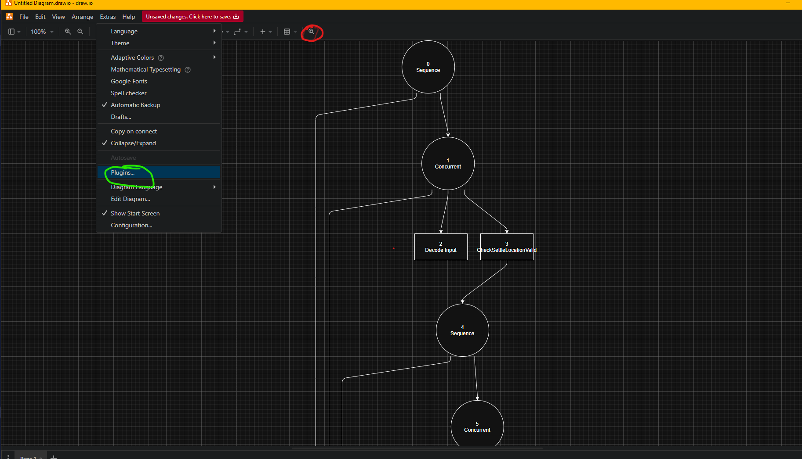

# About

This plugin for the diagram software draw.io (https://www.drawio.com/) is designed to be used for modding in Civilization VII (and is likely
compatible with Civ VI). It only requires to be installed in the latest version of draw.io (as of now, v26.09) and uses
your database.sqlite file generated when loading into a game to parse out behavior trees.

# Installation
To install, click the green tab marked Code on the homepage, then Download Zip. Unzip the downloaded file from this github page.
You will also need to install draw.io, you can get it from here:
https://github.com/jgraph/drawio-desktop/releases

Open drawio once to verify it works. Create a shortcut to draw.io, and right click>Properties then add --enable-plugins to 
the target field like so:

Launch draw io using that shortcut from now on.

Open draw.io and Create New Diagram>Blank Diagram. Go to Extras>Plugins and click Add in the Dialog, then External Plugins> Select File...

Use that to add BehaviorNodeBuilder.js from the zip file, and then repeat this process to add sql-js-loader.js

Then click close, and close drawio, reopen and make a new file. At the top toolbar, there should now be an option on the
far right of the toolbar that looks like a magnifying glass. Click that, and it will open a dialog box with some preset
SQL you can alter to target whichever behaviorTree you want. It will also have a choose file section. Use this to select
C:\Users\$USERNAME\AppData\Local\Firaxis Games\Sid Meier's Civilization VII\Debug\gameplay-copy.sqlite .
If this doesn't exist, you need to alter your AppOptions.txt in C:\Users\$USERNAME\AppData\Local\Firaxis Games\Sid Meier's Civilization VII 
to generate the debug db files.

All things going well, after clicking Load Database, it should generate a tree with nodes and leaves corresponding to the Tree.

Plugins can be added in the green circled area. My plugin button to load a database is circled in red.

I had an occasional issue where the plugin would stop loading after relaunching a few times. If that happens, 
remove the plugin in the app, and also go to C:\Users\$USERNAME\AppData\Roaming\draw.io\plugins and delete the files
stored there, then reinstall the plugin. For that, blame the devs of draw.io, not me.

# Future Development

A major feature i plan to implement is generating SQL code against the DB according to a tree node layout the user has 
defined. I also plan to incorporate cross referencing from other tables for more detailed development.

Currently the algorithm to build the tree is to generate all the nodes, then make edges where a JumpTo exists, and where
a node is otherwise parentless, walk backwards in the NodeId to find the first node with a shapeId that is not 1, which
seems to indicate a leaf node. If you are knowledgeable in this department, and notice a mistake or an oversight, please
contact me, as i built it using roughly guesswork and someone elses diagram of an existing tree.
